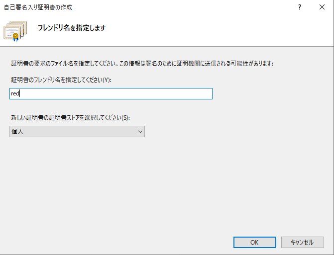

# iis-sqlserver-spring-boot

# summary

1. SQLServer
  - インストール or Docker
  - TCP/IP設定の有効化
2. SSMS
  - インストール
  - データベース作成
  - ユーザ作成
2. spring-boot
  - JDK 17インストール
  - DB接続設定
  - 起動確認
3. IIS
  - インストール
  - サーバー証明書作成
  - バインド追加
4. ARR
  - インストール
  - リバースプロキシ設定
5. hosts
  - 設定

# リリース用の本番環境イメージ図


# 今回構築するローカル開発環境イメージ図

一台のWindows端末内に構築を行う


## 前提環境

- windows10 or windows11
- JDK 17

## SQLServerインストール

https://github.com/namickey/sql-server-try?tab=readme-ov-file#for-install  

変更点  
- インストールの種類は`カスタム`
- 無償エディション
- 機能は`データベースエンジン`のみにチェック
- インスタンス構成は`既定のインスタンス`
- 認証モードは`混合モード`
  - SQLServer管理者の指定は、`現在のユーザーの追加`
- データディレクトリのルートディレクトリのパスを変更
- 最大メモリの設定　※設定しないと物理メモリを使い切ってしまうため設定する

## インストールせずに、Docker起動する場合

https://github.com/namickey/sql-server-try?tab=readme-ov-file#docker  


## TCP/IP設定の有効化

4.1 Sql ServerのTCP/IPの設定  
https://intellectual-curiosity.tokyo/2021/12/31/spring-boot%E3%81%A7%E3%83%87%E3%83%BC%E3%82%BF%E3%83%99%E3%83%BC%E3%82%B9%EF%BC%88sql-server%EF%BC%89%E3%81%AB%E3%82%A2%E3%82%AF%E3%82%BB%E3%82%B9%E3%81%99%E3%82%8B%E6%96%B9%E6%B3%95/  

SQLServer構成マネージャーを起動し、ネットワーク構成のSQLSERVERプロトコルの`TCP/IP`を`有効`に変えてサービス再起動する  


## SSMSインストール

デフォルト設定でインストール  

## データベース作成

SSMSで接続して、新しいデータベースを作成する  
- オプションの`復旧モデル`は`単純`
- オプションの`IS Read Committed Snapshot On`は`True`

## ユーザ作成

SSMSで接続して、セキュリティからログインを新規作成する  
- ログイン名
- SQLServer認証、パスワード設定
- ユーザーマッピングで、作成したデータベースをマップする。
  - また作成したデータベースに対して、データベースロールのメンバーシップで`db_owner`を設定する

## JDK 17インストール

Java環境構築(Windows版)　JDKインストール  
https://www.techfun.co.jp/services/magazine/java/windows-jdk-install.html  

Java環境構築(Windows版)　パスの設定  
https://www.techfun.co.jp/services/magazine/java/windows-jdk-pathset.html  

## spring-bootのDB接続設定

以下のapplication.propertiesに`url`、`username`、`password`を設定する  

src\main\resources\application.properties  
```
### SQLServerデータベース接続設定
spring.datasource.url=jdbc:sqlserver://localhost:1433;databaseName=reddb;encrypt=false
spring.datasource.username=red
spring.datasource.password=admin

### データベース初期化用DDL実行モード
spring.sql.init.mode=always
spring.sql.init.encoding=utf-8

### スネークケースのDBカラム名をSpringのEntity側ではキャメルケースとして対応付けてくれる。
mybatis.configuration.map-underscore-to-camel-case=true
```

## 起動確認

spring-bootアプリケーションを起動し、DB接続確認を行う  
```
spring-bootアプリケーションディレクトリでコマンドプロンプトを起動し、以下を実行
mvnw.cmd spring-boot:run
```
ブラウザで`http://localhost:8080`にアクセスする  

## IISインストール

【IIS】インストールとアンインストール  
https://qiita.com/mihooo24/items/01057be40c7d3862920e  

ブラウザで`http://localhost`にアクセスする  

## サーバー証明書作成

インターネットインフォメーションサービス（IIS）マネージャーを開き、トップ階層にある`サーバー証明書`を開く  
サーバー証明書画面の右側にある`自己署名入り証明書の作成`を行う  
- フレンドリ名は作成したいサイトのホスト名を入力する
- ストア先は`個人`



## バインド追加

インターネットインフォメーションサービス（IIS）マネージャーを開き、サイト配下の`Default Web Site`を開き、右側のサイト編集の`バインド`を開く  

以下のバインドを追加する  
- 種類は`https`
- IPアドレスは`未使用のIPアドレスすべて`
- ポートは`443`
- ホスト名はサーバー証明書作成時に作成したホスト名（フレンドリ名）
- SSL証明書は作成したサーバー証明書を選択する


## ARRインストール

Application Request Routingモジュールをダウンロードし、インストールする  
インストールすることでリバースプロキシ設定が可能となる

https://qiita.com/yaju/items/a86f26d6dd7977695457#application-request-routingarr  

## リバースプロキシ設定

インターネットインフォメーションサービス（IIS）マネージャーを開き、サイト配下の`Default Web Site`を開き、`URL書き換え`を開く  
右側の`規則の追加`を開き、`リバースプロキシ`を選択し、規則を追加する
- 受信規則に転送先としてspring-bootアプリケーションのURLである`localhost:8080`を設定する。
- SSLオフロードは`有効`のまま
- 送信規則の`HTTP応答のリンクのドメイン名を書き換える`に`チェック`する
- 場所は自動入力`localhost:8080`のまま
- 宛先はサーバー証明書作成時に作成したホスト名（フレンドリ名）を指定する


## hostsに追加

【簡単】WindowsでHostsファイルが編集できないときの対処法  
https://hayamizbg.net/hosts-file-techniques/  

hostsファイルにlocalhostを示すループバックIPアドレスと、サーバー証明書作成時に作成したホスト名（フレンドリ名）を追記する  
```
127.0.0.1  red
```

## 動作確認

ブラウザで`https://red`にアクセスする  
自己証明書なので、接続が保護されないメッセージが出るがアクセスすると、httpsでspring-bootアプリケーションの画面が表示される    

SSLサーバ証明書のエラーや警告まとめ  
https://jp.globalsign.com/ssl/about/ssl_error.html  

